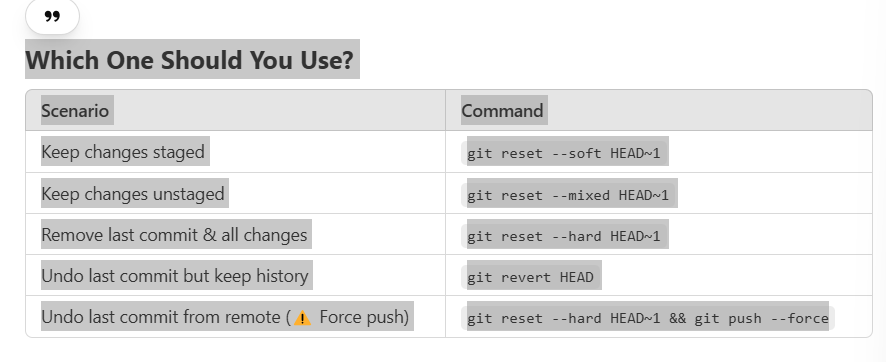

## End to End Machine Learning Project                                                                      

"""Which One Should You Use?
Scenario	Command
Keep changes staged	git reset --soft HEAD~1
Keep changes unstaged	git reset --mixed HEAD~1
Remove last commit & all changes	git reset --hard HEAD~1
Undo last commit but keep history	git revert HEAD
Undo last commit from remote (⚠️ Force push)	git reset --hard HEAD~1 && git push --force

"""